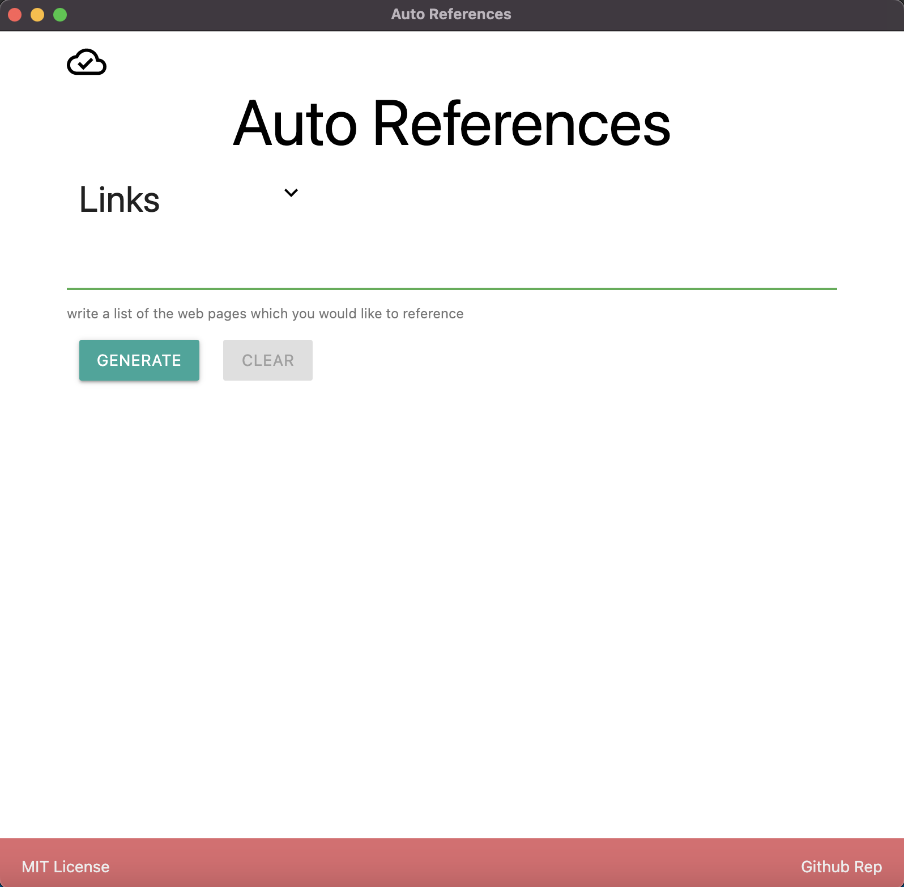
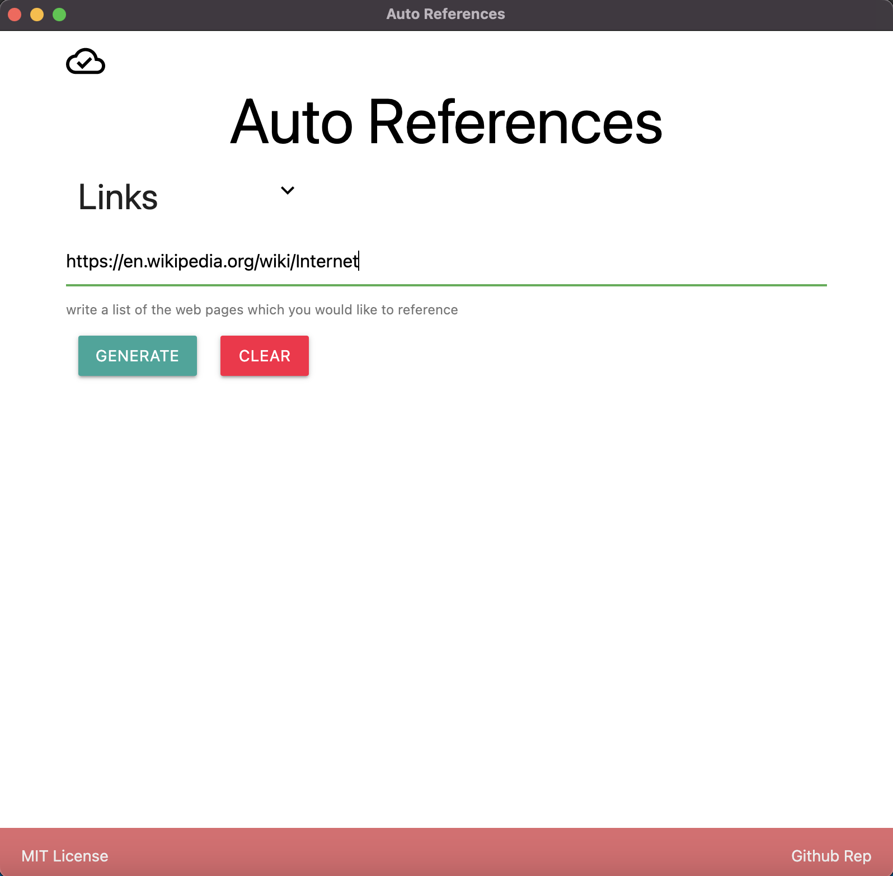
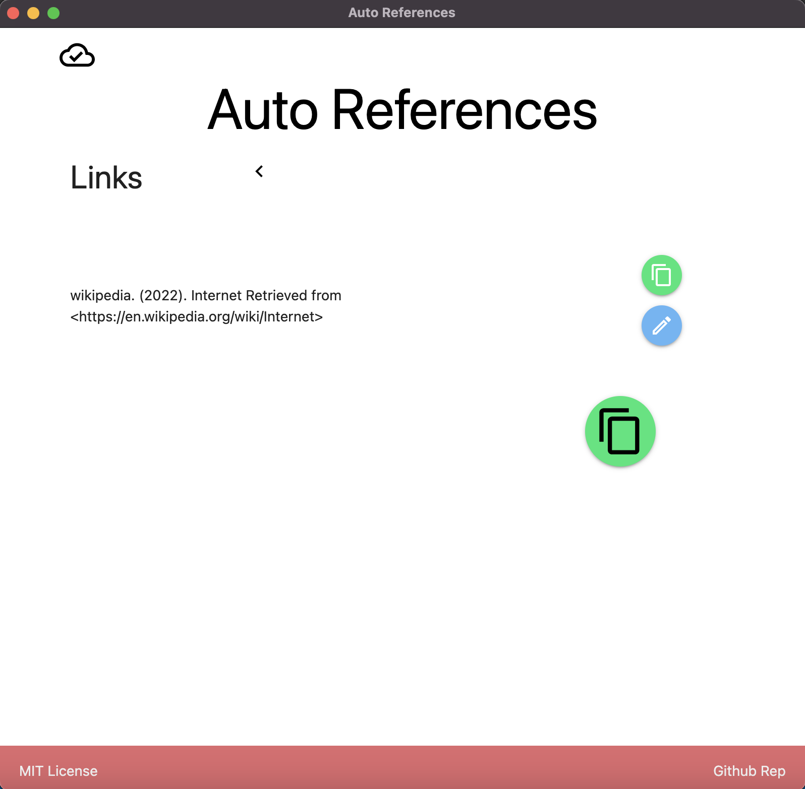

# Auto References

This is a Desktop APP that helps to create references of Web Pages in APA format. This APP is built on Electron JS and React JS. Also, it's fully written in TypeScript.
App Stack:

- React JS
- Electron JS
- Jest
- TypeScript

## Usability

The interface is very simple, with a Textarea for the links and two buttons "generate" and "clear".



The first step is to paste all the links box



Then, it generates the references:



The app will scrape the necessary to generate references from the more common web pages:

- Wikipedia
- Youtube
- StackOverflow

Use the "Copy" button to copy the clipboard of the references.

## Installation process

To use the application locally you should follow the next steps:

```bash
git clone git@github.com:jadry92/Auto-references.git
npm install .
npm run start
```

## Testing

If you are improving the application you can run the unit test using the command:

```bash
npm run test
```

The testing is only for the main backend at the moment
